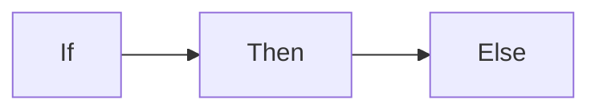

# File to be presented:
# abcder

{}

---

{}

---

---


%%{init:{"fontFamily":"monospace", "sequence":{"showSequenceNumbers":true}}}%%
sequenceDiagram
    Alice->>John: Hello John, how are you?
    loop Healthcheck
        John->>John: Fight against hypochondria
    end
    Note right of John: Rational thoughts!
    John-->>Alice: Great!
    John->>Bob: How about you?
    Bob-->>John: Jolly good!
